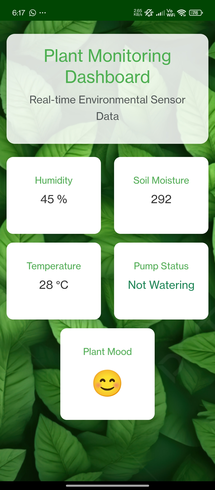
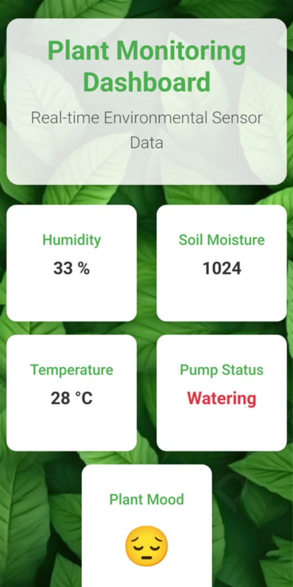
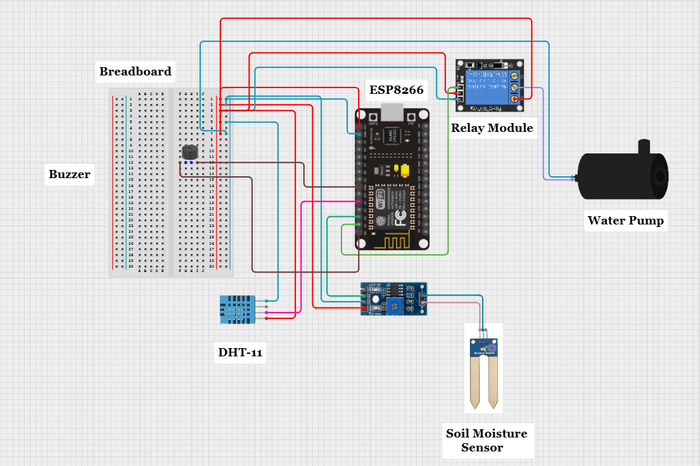

# Plant_Monitoring_System

**Description:**
This project is an IoT-based Plant Monitoring System that tracks environmental conditions like soil moisture, temperature, and humidity using an ESP microcontroller and various sensors.
It features a buzzer that activates when soil moisture drops below a threshold, followed by automatic irrigation.
A web-based dashboard and Android application (.apk) provide real-time visualization of sensor readings and system status.

**Technologies Used**
ESP8266 
Arduino IDE (C++ based firmware)
Soil Moisture Sensor
DHT11 Sensor (for temperature & humidity)
Buzzer
Relay Module (for water pump control)
Water Pump (5V/12V)
Firebase 
HTML, CSS, JavaScript (for web dashboard)
Android WebView App (.apk)

**Features**
Real-time soil moisture, temperature, and humidity readings
Buzzer alert when moisture level drops
Automatic watering trigger when moisture is low.
Cloud based dashboard to visualize data remotely
Power-efficient and compact design

**Project Visuals**
**Dashboard Screenshot**

**Wiring Diagram**

(Also refer images folder)

**System Workflow**
Sensors continuously measure environmental data.
If soil moisture is below the set threshold:
        - Buzzer activates as an alert
        - Water pump is automatically turned on via relay
Pump turns off once sufficient moisture level is restored
Data is sent to Firebase  for display

**Web and Android Dashboard**
A web-based and Android dashboard has been developed to display real-time data from the ESP module. The dashboard shows:
Humidity (%)
Soil Moisture 
Temperature (°C)
Pump Status (Watering/Not Watering)
Plant Mood (based on thresholds)

## Source Code

You can find the complete Arduino code in the [`src/code.ino`](src/code.ino) file.
